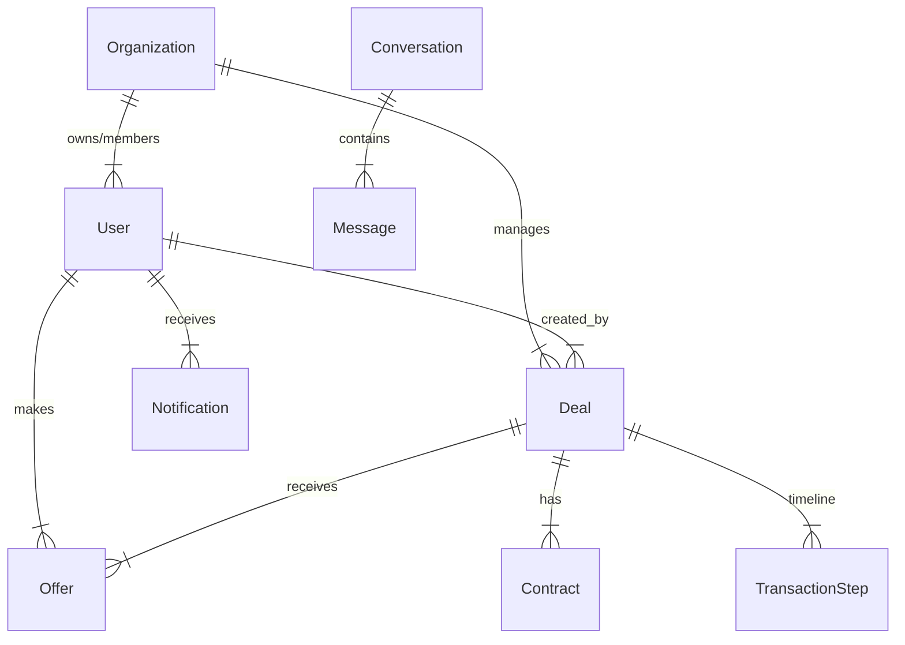

# Database Schema

Homify-v1 uses a relational PostgreSQL database managed by TypeORM.

## Diagram (ERD Context)

## Key Entities

### Identity & Access
-   **`users`**: System users. Stores email, hashed password, profile info.
-   **`organizations`**: Tenants. The boundary for data isolation.
-   **`organization_members`**: Link between Users and Organizations. Stores `roleId`.
-   **`roles`**: RBAC definitions (e.g., 'Agent', 'Investor').
-   **`permissions`**: Granular capabilities (e.g., 'deal:create').

### Real Estate Core
-   **`deals`**: The central entity. Represents a property opportunity.
    -   *Fields*: `title`, `address`, `price`, `status`, `specs` (beds, baths).
-   **`media`**: Files associated with Deals (Images, Docs). Polymorphic (`entityType`, `entityId`).

### Transactional
-   **`offers`**: Purchase offers from Investors to Agents.
    -   *Fields*: `amount`, `status`, `terms`.
-   **`contracts`**: Legal documents.
    -   *Fields*: `type`, `status`, `contentUrl`.
-   **`transaction_steps`**: Checklist items for the closing process.
-   **`payments`**: Records of Earnest Money or Fees.

### Communication
-   **`conversations`**: Chat threads. Can be linked to a `dealId`.
-   **`messages`**: Individual chat messages.
-   **`notifications`**: User alerts.

### User Preferences
-   **`saved_searches`**: Persisted filter criteria for property alerts.
-   **`investor_profiles`**: Extended profile data for Investor users.

## Schema Management

We use TypeORM Migrations to manage schema changes.

-   **Generate Migration**: `npm run db:generate -w homify-web`
-   **Run Migrations**: `npm run db:run -w homify-web`
-   **Revert Migration**: `npm run db:revert -w homify-web`

*Always verify `data-source.ts` lists all active entities.*
