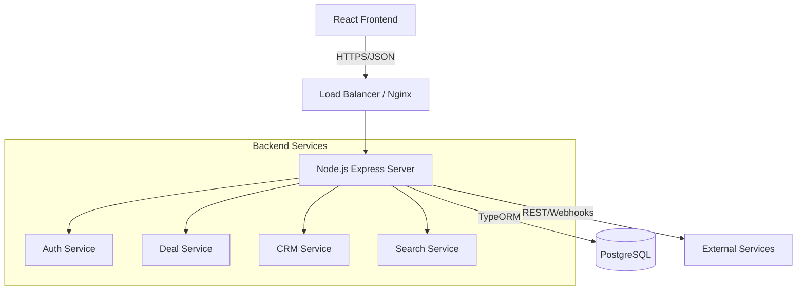

# System Architecture

## Overview
Homify-v1 is a monorepo-based Real Estate Ecosystem designed for high scalability and modularity. It serves as a dual-sided marketplace for Investors and Agents, powered by a robust CRM and Transaction Management engine.

## Technology Stack

### Frontend (`apps/web`)
-   **Framework**: React 18 + Vite
-   **Language**: TypeScript
-   **UI Library**: Material-UI (MUI) v5 + TailwindCSS
-   **State Management**:
    -   **Global App State**: Redux Toolkit + Redux Saga
    -   **Server State**: TanStack Query (via tRPC)
-   **API Client**: tRPC Client (Type-safe RPC)

### Backend (`apps/web/src/server`)
-   **Runtime**: Node.js
-   **Framework**: Express.js
-   **API Layer**: tRPC (TypeScript Remote Procedure Call)
-   **Database ORM**: TypeORM
-   **Database**: PostgreSQL
-   **Authentication**: JWT (JSON Web Tokens)

## Architecture Diagram

## Core Modules

### 1. Authentication & Identity
-   **Multi-tenancy**: Users belong to **Organizations**. Data is isolated by `organizationId`.
-   **RBAC**: Role-Based Access Control (`OrgOwner`, `OrgAdmin`, `Agent`, `Investor`).
-   **Entities**: `User`, `Organization`, `OrganizationMember`, `Role`, `Permission`.

### 2. Deal Management
-   **Lifecycle**: Draft -> Published -> Offer -> Under Contract -> Closed.
-   **Marketplace**: Public listing of deals for Investors.
-   **Entities**: `Deal`, `Media`, `PropertyDetails`.

### 3. CRM & Integration
-   **Adapter Pattern**: Integrating external CRMs (e.g., Salesforce).
-   **Sync**: Bidirectional sync of Contacts and Deals.

### 4. Communication
-   **Messaging**: Real-time chat (Conversations, Messages).
-   **Notifications**: In-app alerts for critical events.

### 5. Transaction Engine
-   **Workflows**: Step-by-step closing checklists.
-   **Contracts**: Document generation and e-signature tracking.
-   **Offers**: Purchase offer negotiation.

## Key Design Patterns

-   **Service Layer Pattern**: All business logic resides in `src/services/`. Routers (`src/server/routers/`) are thin wrappers around services.
-   **Dependency Injection**: Services utilize repositories and other services via constructor injection (or singleton pattern).
-   **Type Safety**: Shared types between Frontend and Backend via tRPC inference.
